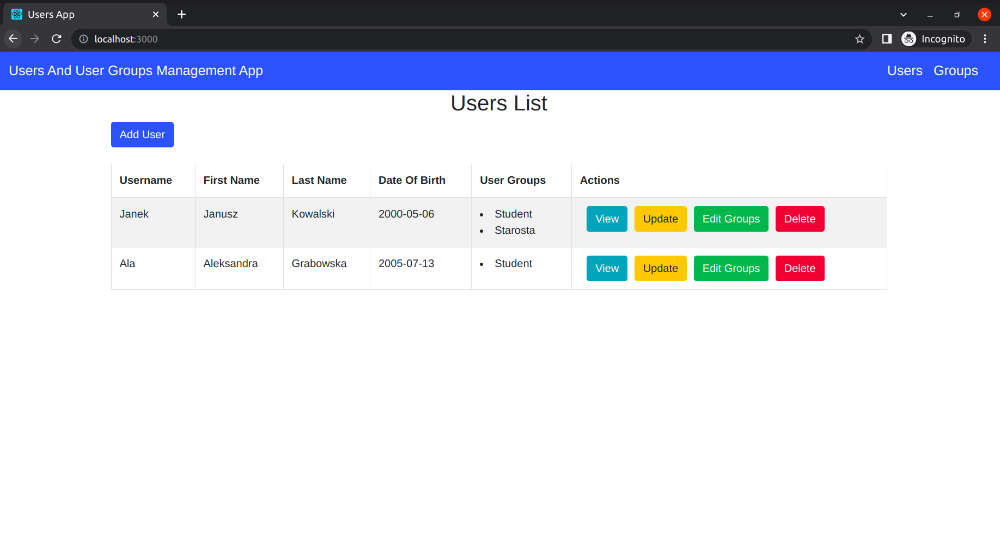
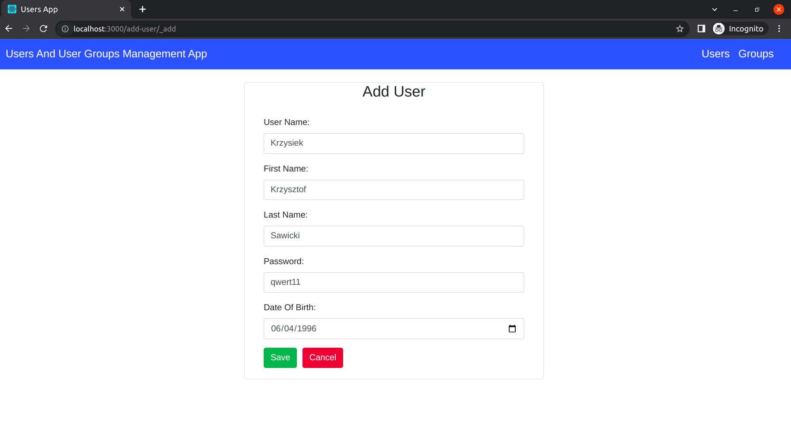
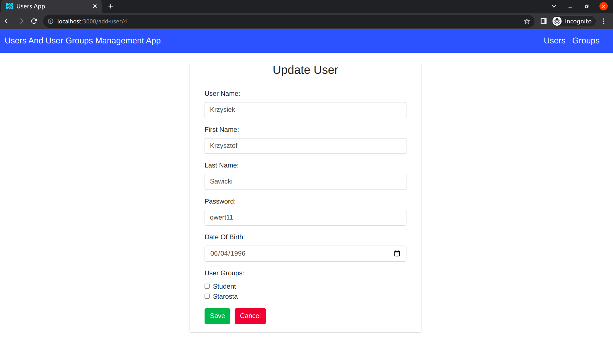
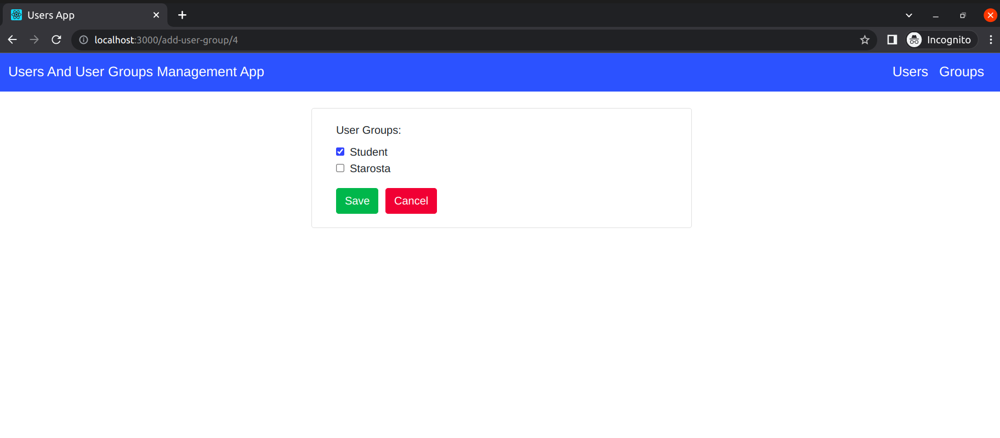
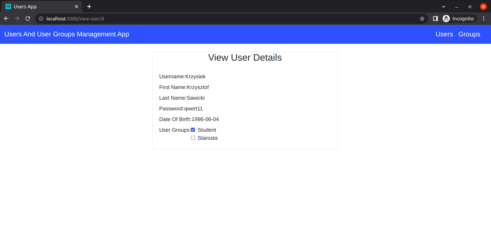
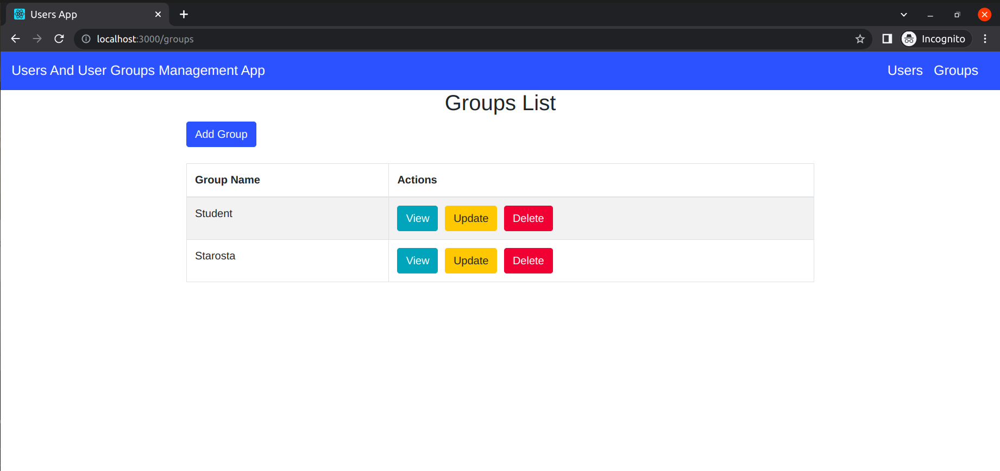
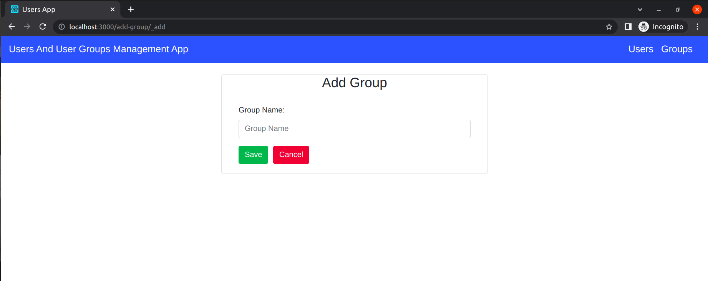
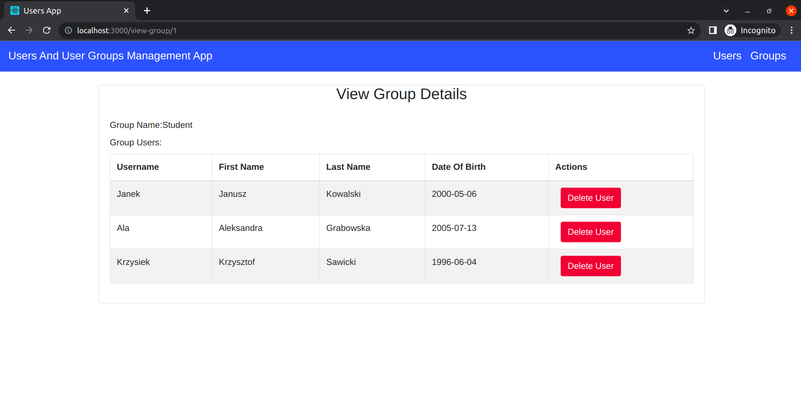
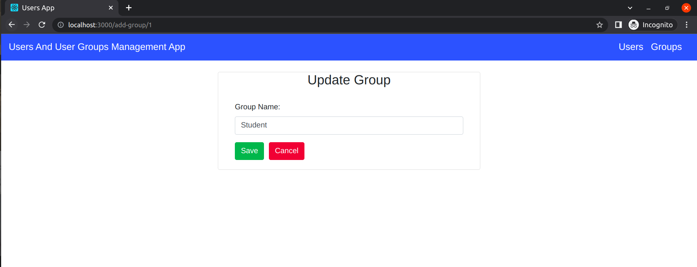

# Users And User Groups Management App

### Technologies used:

- PHP (backend)
- Mysql (database)
- React JS (frontend)
- Bootstrap (styling)

### Functionality:

- Users overview

- Adding New User

- Updating user details

- Updating user groups

- View user details

- Groups overview

- Add group

- View group details

- Update group 

- Delete user
- Delete group
- Delete user from group
